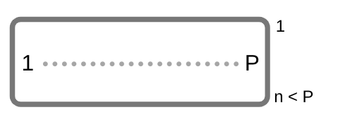
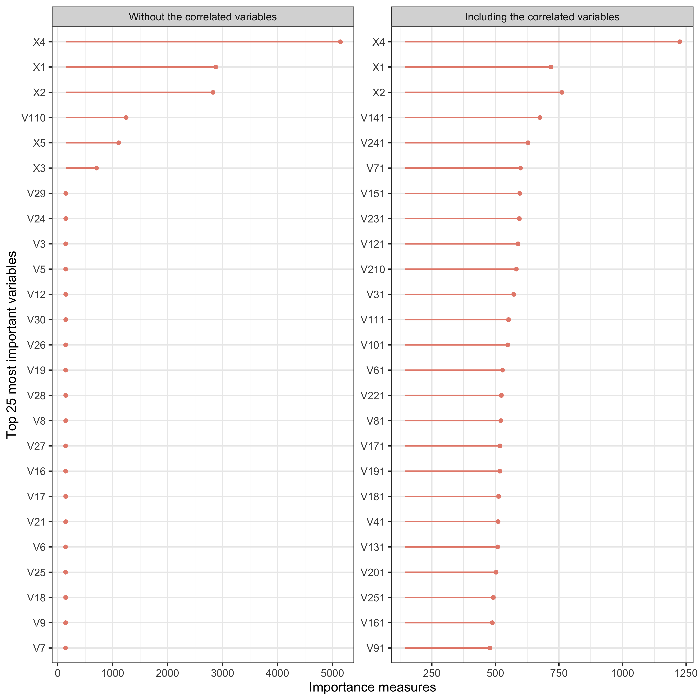
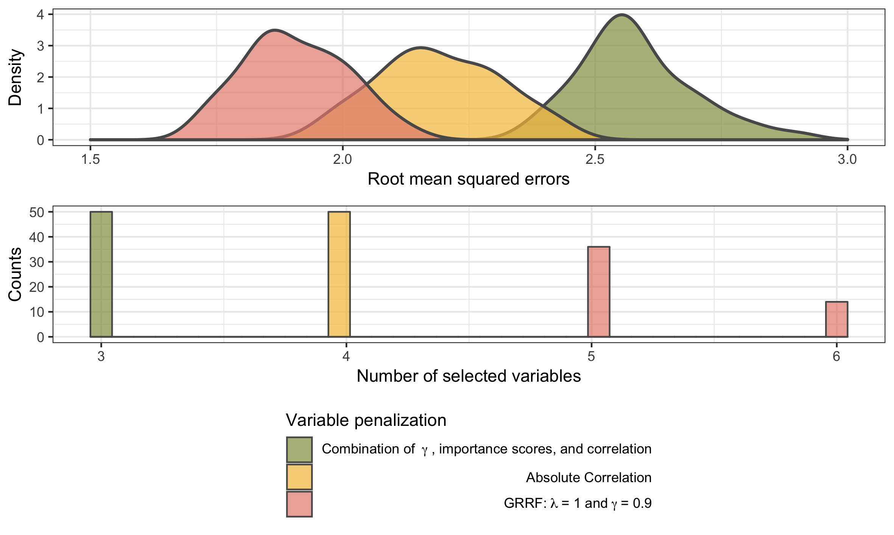
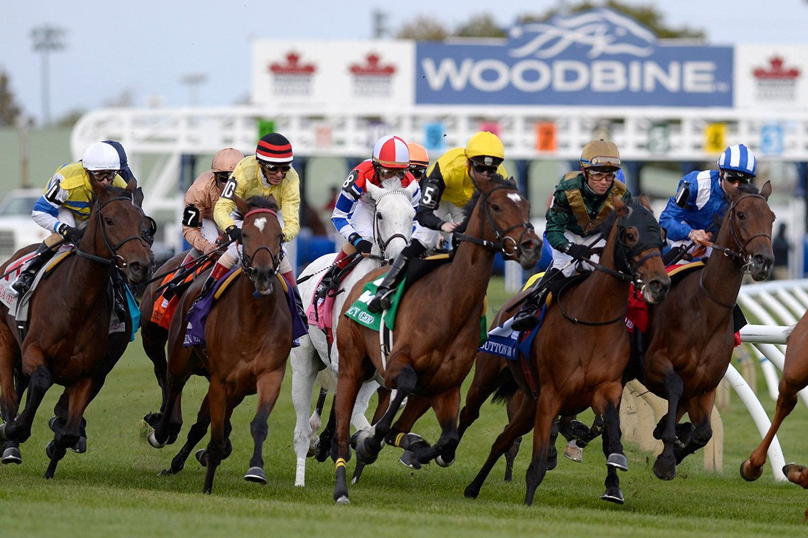
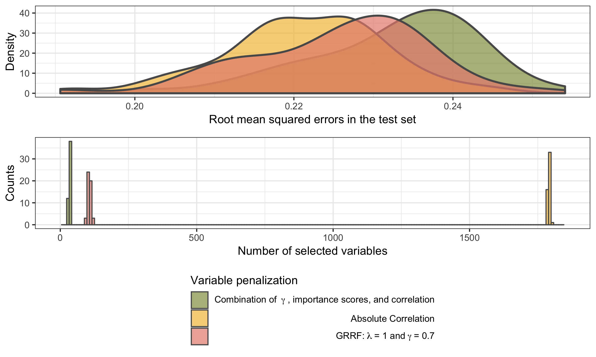
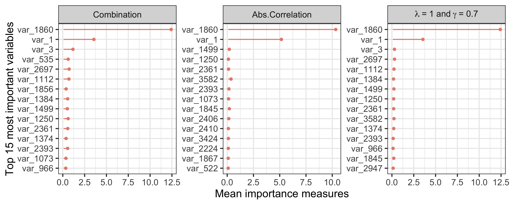

```{r setup, include=FALSE}
options(htmltools.dir.version = FALSE)
knitr::opts_chunk$set(message = FALSE, 
                      warning = FALSE, 
                      echo = FALSE, 
                      cache = TRUE, 
                      fig.align = 'center', 
                      eval = FALSE)
library(RefManageR)
library(tidyverse)

bibs <- ReadBib("CASI/bibliography.bib", check = FALSE)
```

class: middle

# Outline

  1. Motivation
  2. Tree-based models
    - Trees
    - Random Forests
  3. Regularization in Random Forests
    - Guided Regularization in Random Forests (GRRF)
  4. Applying the GRRF
    - Simulated data 
    - Real data 
  5. Conclusions and Final Remarks


---
class: inverse, middle, center


# 1.  Motivation

---
# 1.  Motivation

- Predictors can be hard or economically expensive to obtain. 

- Feature selection $\neq$ Shrinkage/regularization: 'shrinks' the regression coefficients towards zero. 

- For tree-based methods, there is not yet a well established 
regularization procedure in the literature.

- We are interested in tree models when there are many more predictors than observations:
  - Simulated data 
  - Real data 

```{r, fig.cap="Figure 1. Big P, small n", out.width="30%", eval = TRUE}

```


---
class: inverse, middle, center


# 2. Tree-based models

---
# 2. Tree-based models
## Trees

```{r, fig.cap="Figure 1. Example of a decision tree. ", out.width="50%", eval = TRUE}
knitr::include_graphics("img/trees.png")
```


---
## Trees

Consider a continuous variable of interest $Y_i \in \mathbb{R}$ 
and $\mathbf{x} = (x_{i1},\dots, x_{ip})'$ the set 
of predictor features, $i = 1 \dots n$. 

- Each estimated rule has the form: $x_j > x_{j,th}$, where 
$x_j$ describes the value of the feature at $j$ and $x_{j,th}$ is the 
decision cut point. 
- The model predicts $Y$ with a constant $c_m$ in each splitted region $R_m$,
usually the mean of $y$, or

\begin{equation}
\hat f(\mathbf{x_i}) =  \sum_{m = 1}^{M} c_m I\{\mathbf{x_i} \in R_m  \},
\end{equation}

where $\mathbf{x}$ represents the set of predictor variables. 

- The minimized measure is the residual sum of squares, given by

\begin{equation}
RSS_{tree} =  \sum_{j = 1}^{J} \sum_{i \in R_j} (y_i - \hat y_{R_j})^2
\end{equation}

where $\hat y_{R_j}$ is the mean response in the *j*th region of the predictors'space. 


---
## Random Forests 

- It is an average of many trees grown in Bootstrap samples.
- Simple way to reduce variance in tree models: 
  - take many training sets from the population with bootstrap resampling,
  - build a separate prediction for each dataset and 
  - average their final predictions, resulting in

\begin{equation}
\hat f_{avg}(\mathbf{x}) = \frac{1}{B} \sum_{b=1}^{B} \hat 
f^{(b)}(\mathbf{x}),
\end{equation}

`r Cite(bibs[key = "HastieTrevor"])`

<b> Variable importance:</b> improvement in the splitting criteria (RSS) for 
  each variable
  
- Those values are accumulated over all of the trees

- It facilitates feature selection in random forests

- Unwanted behavior when in the presence of highly correlated variables: 
the importances are split between the correlated features. 


```{r, out.height="50%", out.width="50%", fig.height=5, eval = FALSE, fig.cap="Figure 1. Example where a Random Forest would capture well the decision rules. The axis represent 2 predictor variables and the color replesents a categorical response variable to be predicted."}
knitr::include_graphics("img/decision.png")
```


---
class: inverse, middle, center
#  3. Regularization

---
#  3. Regularization

- Regularized regression consists in estimating a penalized function of the form

\begin{equation}
\underset{f \in H}{min} \Big[ \sum_{i = 1}^{N}
L(y_i, f(x_i)) + \lambda J(f) \Big ], 
\end{equation}


where $L(y, f(x))$ is the chosen loss function, $J(f)$ is a penalty
functional, and $H$ is a space of functions on which $J(f)$ is defined
`r Cite(bibs[key = "HastieTrevor"])`.

- Produces models that are more parsimonious and have similar 
prediction error as the full model. 

- It is usually robust enough to not be influenced by the correlated variables. 

---
## Regularization in Random Forests

- One option is presented in `r Cite(bibs[key = "guided"])`:
  - The authors **penalise the gain (RSS reduction)** of each 
  variable, for each tree when building a random forest.

- The main idea is to weigh the gain of each variable, with

$$\begin{equation} Gain_{R}(X_i, v) =  \begin{cases} \lambda_i Gain(X_i, v), i \notin F \text{ and} \\ Gain(X_i, v), i \in F,  \end{cases} \end{equation}$$


where $F$ represents the set of indices used in the previous nodes and 
$\lambda_i \in (0, 1]$ is the penalization applied to the splitting. 


- The variables will only get picked if their gain is **very** high. 


---
## How is $\lambda_i$ chosen?


The Guided Regularized Random Forests (GRRF) proposes the regularization
parameter $\lambda_i$ as: 

\begin{equation}
\lambda_i = (1 - \gamma)\lambda_0 + \gamma Imp'_{i},  
\end{equation}

being that $\lambda_0$ represents the baseline regularization parameter 
and $\gamma \in [0, 1]$, and $Imp'_{i}$ is a standardized importance measure obtained from a random forest. 

- Larger $\gamma$ = smaller $\lambda_i$ =  larger penalty on $Gain(X_i, v)$


- <b>We generalize the method to</b>

$$ \lambda_i = (1 - \gamma) \lambda_0(v) + \gamma g(X_i), $$ 

where $g(X_i)$ is some function of the predictors and $\lambda_0(v)$ can
depend on some characteristic of the tree. 

- Gives us more flexibility regarding the weights 
of the gains for each variable.  

---
class: inverse, middle, center


#  4. Applying the GRRF

---
## Methods: models 

- Our next results are using the GRRF with three main configurations:

  1. Fixing $\gamma = 0.9$,  $\lambda_0(v) = 1$ and $g(X_i) = Imp_{i}^{'}$, or
  $$\lambda_i = (1 - 0.9) 0.8 + 0.9 Imp_{i}^{'}$$
  
  2. Fixing $\gamma = 1$, $\lambda_0(v) = 0$ and $g(X_i) = |corr(X_i, y)|$, or 
  $$\lambda_i = (1 - 1) 0 + 1 |corr(X_i, y)|$$
  
  3.  Fixing $\gamma = 0.9$, $\lambda_0(v) = 0$ and 
$\begin{equation} g(X_i) =  \begin{cases} |corr(X_i, y)| Imp_{i}^{'} \textbf{,   if } |corr(X_i, y)| > 0.5 \text{ and} \\ Imp_{i}^{'} 0.2 \textbf{,   if } |corr(X_i, y)| \leq 0.5 \end{cases} \end{equation}$, or 

$$\begin{equation} \lambda_i =  \begin{cases} (1 - 0.9) 0 + 0.9 Imp_{i}^{'}  |corr(X_i, y)| \textbf{,   if } |corr(X_i, y)| > 0.5  \\  (1 - 0.9) 0 + 0.9 Imp_{i}^{'} 0.3 \textbf{,   if } |corr(X_i, y)| \leq 0.5  \\ \end{cases} \end{equation}$$

we <b>weigh down</b> the variables that were not much correlated to the
response, using the Spearman correlation.


---
## Methods: simulating data 

Using the model equation proposed in 
`r Cite(bibs[key = "Friedman1991"])` , we simulated a 
response variable $Y$ and its relationship to
a matrix of predictors $\mathbf{X}$ as

\begin{equation}
y_i = 10 sin(\pi x_{i1} x_{i2}) + 20 (x_{i3} -
0.5)^{2} + 10 x_{i4} + 5 x_{i5} +
 \epsilon_i, \thinspace
\epsilon_i \stackrel{iid}\sim N(0, \sigma^2),
\end{equation}

where $\mathbf{X} \in [0, 1]$, so the predictors
were randomly drawn from a standard Uniform distribution. 

- Creates nonlinear relationships and interactions between the response and the predictors. 

- The five true predictors were added to:

  - 25 variables correlated to one of the true predictors (randomly selected);
  - 30 different variables drawn from a Normal distribution, with a random mean and standard deviation (pure noise); 


- **50** different datasets of the same form were simulated and split into
train (75%) and test (25%) sets. 

**Why should we care about correlated predictors?**

---

```{r, fig.cap="Figure 2. Mean variable importance in a Random Forest applied to the 50 datasets, with the correlated variables and without them.", out.width="80%", eval = TRUE}

```

Clear split of the importance between the correlated variables in a standard Random Forest! **Misleading when we need to select variables.**

---

## Applying the models: simulated data

```{r, fig.cap="Figure 3. Root mean squared errors and counts of final variables in each fit using the simulated data ", out.width="100%", eval = TRUE}

```

---

## Results: simulated data

- All models selected a small number of variables. 
- Fewer variables for the third method: ideal scenario when we need to do
regularization

**Given the correlated variables, which were selected by the models?**


```{r, eval = TRUE, results='asis'}
library(kableExtra)
library(formattable)

tab <- read.table("CASI/data/percs_sim.txt")

tab %>% 
  select(model, perc) %>% 
    mutate(
      perc = round(perc, 3),
      perc = 
        ifelse(perc > 0.93,
               color_bar("lightgreen")(perc),
               color_bar("lightyellow")(perc))) %>% 
  mutate(model = forcats::fct_recode(
    model,
    "1st: Using lambda and gamma" = "gamma",
    "2nd: Correlation" = "corre",
    "3rd: Gamma, importance scores and correlation" = "comb"
  )) %>% 
  setNames(c("Model", "Percentage")) %>% 
  knitr::kable(escape = FALSE, format = 'html',
               caption="Table 1. Percentage of variables for each model that were the true ones or correlated to the true ones.") %>%
  kable_styling(bootstrap_options = c("condensed", "hover"), 
                full_width = FALSE) %>% 
  column_spec(2, width = "4cm")  
```


- **We avoided the correlated predictors'issue!**


---
## Applying the models: real data

- Goal: predict the log of best race distance for bred racehorses

```{r, fig.cap="Figure 3. Racehorses.", out.width="80%", eval = TRUE}

```

---

## Applying the models: real data

- Predictors: trinary SNP and general variables including sex, inbreeding, 
and region.

- Main issues:
  - Big P, small n!
  - Predictors are **correlated**,
  - Each variable is **very** expensive to obtain. 

- Data:
  - Originally 48910 predictors and 835 observations
  
  - The dataset was previously filtered for the predictors that had at
  least some (Spearman) correlation with the response (>0.15)
    - Resulted in 3582 predictors
    
  - The filtered dataset was split into 50 different train (75%) and
test sets (25%). 


---

## Results: real data

```{r, fig.cap="Figure 4. Root mean squared errors and counts of final variables in each fit using the real data", out.width="100%", eval = TRUE}

```


---

## Results: real data

```{r, results='asis', eval = TRUE}
tab <- read.table("CASI/data/real_res.txt") %>% 
    filter(!model == "Using just lambda")

tab %>% 
  select(model, max, min, mean) %>% 
    # mutate(
    #   max = 
    #     ifelse(max < 50,
    #            color_bar("lightgreen")(max),
    #            ifelse(max > 1050,       
    #                   color_bar("tomato")(max),
    #                   color_bar("lightyellow")(max))),
    #   
    #   min = 
    #     ifelse(min < 50,
    #            color_bar("lightgreen")(min),
    #            ifelse(min > 1050,       
    #                   color_bar("tomato")(min),
    #                   color_bar("lightyellow")(min))),
    #   
    #   mean = 
    #     ifelse(mean < 50,
    #            color_bar("lightgreen")(mean),
    #            ifelse(mean > 1050,       
    #                   color_bar("tomato")(mean),
    #                  color_bar("lightyellow")(mean)))
  mutate(model = forcats::fct_recode(
    model,
    "1st: Using lambda and gamma" = "Using lambda and gamma",
    "2nd: Correlation" = "Correlation",
    "3rd: Gamma, importance scores and correlation" = "Using lambda and gamma * correlation"
  )) %>% 
  setNames(c("Model", "Max.", "Min.", "Mean")) %>% 
  knitr::kable(escape = FALSE, format = 'html',
               caption="Table 2. Summary of number of selected variables in each model.") %>% 
  #kable_styling(bootstrap_options = c("condensed", "hover"), 
  #              full_width = FALSE) %>% 
  column_spec(2, width = "4cm")  


```

```{r, results='asis', eval = TRUE}
tab %>% 
  select(model, max_rmse, min_rmse, mean_rmse) %>% 
  mutate_if(is.numeric, funs(round(., 3))) %>% 
    # mutate(
    #   max = 
    #     ifelse(max < 50,
    #            color_bar("lightgreen")(max),
    #            ifelse(max > 1050,       
    #                   color_bar("tomato")(max),
    #                   color_bar("lightyellow")(max))),
    #   
    #   min = 
    #     ifelse(min < 50,
    #            color_bar("lightgreen")(min),
    #            ifelse(min > 1050,       
    #                   color_bar("tomato")(min),
    #                   color_bar("lightyellow")(min))),
    #   
    #   mean = 
    #     ifelse(mean < 50,
    #            color_bar("lightgreen")(mean),
    #            ifelse(mean > 1050,       
    #                   color_bar("tomato")(mean),
    #                  color_bar("lightyellow")(mean)))
  mutate(model = forcats::fct_recode(
    model,
    "1st: Using lambda and gamma" = "Using lambda and gamma",
    "2nd: Correlation" = "Correlation",
    "3rd: Gamma, importance scores and correlation" = "Using lambda and gamma * correlation"
  )) %>% 
  setNames(c("Model", "Max.", "Min.", "Mean")) %>% 
  knitr::kable(escape = FALSE, format = 'html',
               caption="Table 3. Summary of root mean squared errors for each model.") %>% 
  #kable_styling(bootstrap_options = c("condensed", "hover"), 
  #              full_width = FALSE) %>% 
  column_spec(2, width = "4cm")  


```


---

## What if we have a limited number of variables to use?


```{r, fig.cap="Figure 5. Top 15 mean importance for the variables of each model", eval = TRUE, fig.width=11, fig.height=15}

```


---

## Using the top 15 variables of each model

- We run a standard Random Forest model using the 15 most important variables for each model

- Which model gives us the best predictions if we have a limit of variables to use?

```{r, eval = TRUE, results='asis'}
tab <- read.table("CASI/data/summary_rerun.txt") %>% 
  mutate_if(is.numeric, funs(round(., 4)))

tab %>% 
  select(1, 3,4,2) %>% 
  mutate(s = 
           ifelse(s < 0.216,
                  color_bar("lightgreen")(s),
                  color_bar("lightyellow")(s))) %>% 
  mutate(model = forcats::fct_recode(
    model,
    "1st: Using lambda and gamma" = "gamma",
    "2nd: Correlation" = "corre",
    "3rd: Gamma, importance scores and correlation" = "comb"
  )) %>% 
  setNames(c("Model", "Max.", "Min.", "Mean")) %>% 
  knitr::kable(escape = FALSE, format = 'html',
               caption="Table 5. Summary of root mean squared error in the test set when using the top 15 variables of each model in the 50 datasets") %>%
  kable_styling(bootstrap_options = c("condensed", "hover"), 
                full_width = FALSE) %>% 
  column_spec(2, width = "4cm")  
```


---
class: inverse, middle, center


#  5. Conclusions and Final Remarks

---
#  5. Conclusions and Final Remarks

- Variable selection in Random Forests is still a topic to be explored

- **The GRRF, as proposed in `r Cite(bibs[key = "guided"])`, does not perform the most strict regularization as desired.**


- The third model performed well in the real dataset:
  - It selected way less variables,
  - The model kept a similar prediction power than bigger models,
  - The selected variables were not overall correlated. 

- For categorical predictor variables, correlation might not be the best 
measure to use

- Next steps include proposing new ways of regularizing the trees:
  - Potentially considering the depth of each tree 
  - Delimiting the maximum number of variables to select

`Code: https://github.com/brunaw/regularization-rf` 

---
class: center, middle

## Acknowledgements

This work was supported by a Science Foundation Ireland Career Development Award grant number: 17/CDA/4695

```{r, echo=FALSE, fig.align='center', out.height="40%", out.width="50%", fig.height=2, eval = TRUE}
knitr::include_graphics("img/SFI_logo.jpg")
```


---
# Bibliography


```{r, results='asis', eval = TRUE}
print(bibs[key = c("guided", "Hesterberg2011", "HastieTrevor",
                  "Breiman2001", "Friedman1991")], 
      .opts = list(check.entries = FALSE, 
                   style = "html", 
                   bib.style = "authoryear"))
```


---
class: center, middle, inverse

# Thanks!


 

<b>

[@brunaw](https://github.com/brunaw)
