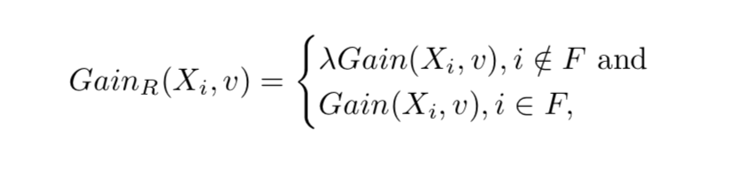
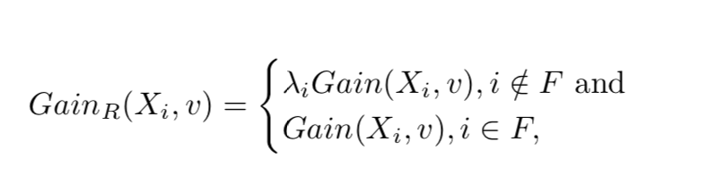
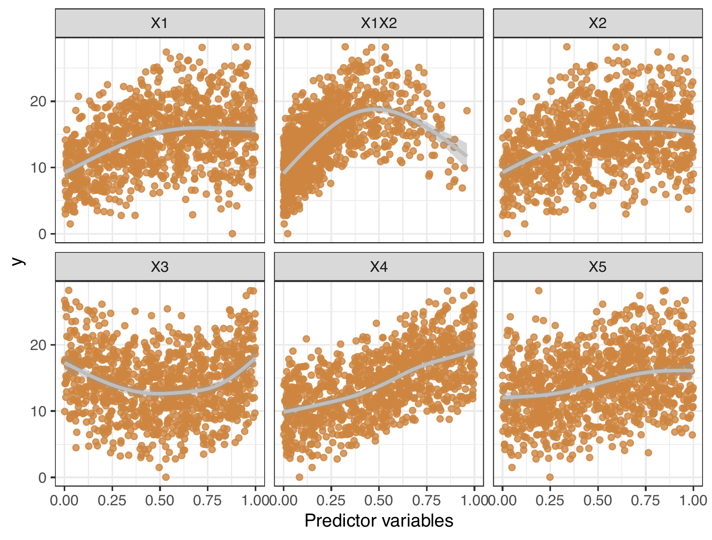
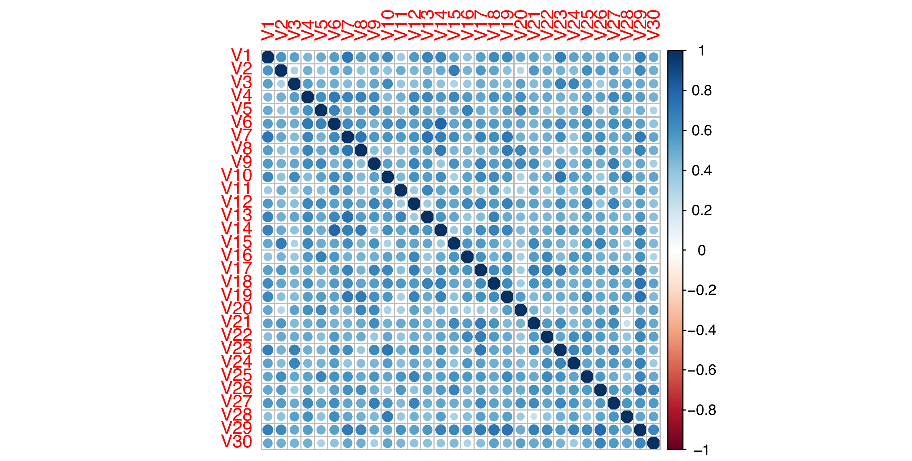
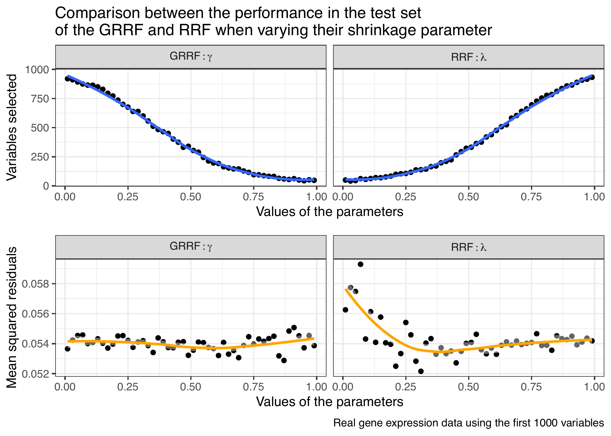
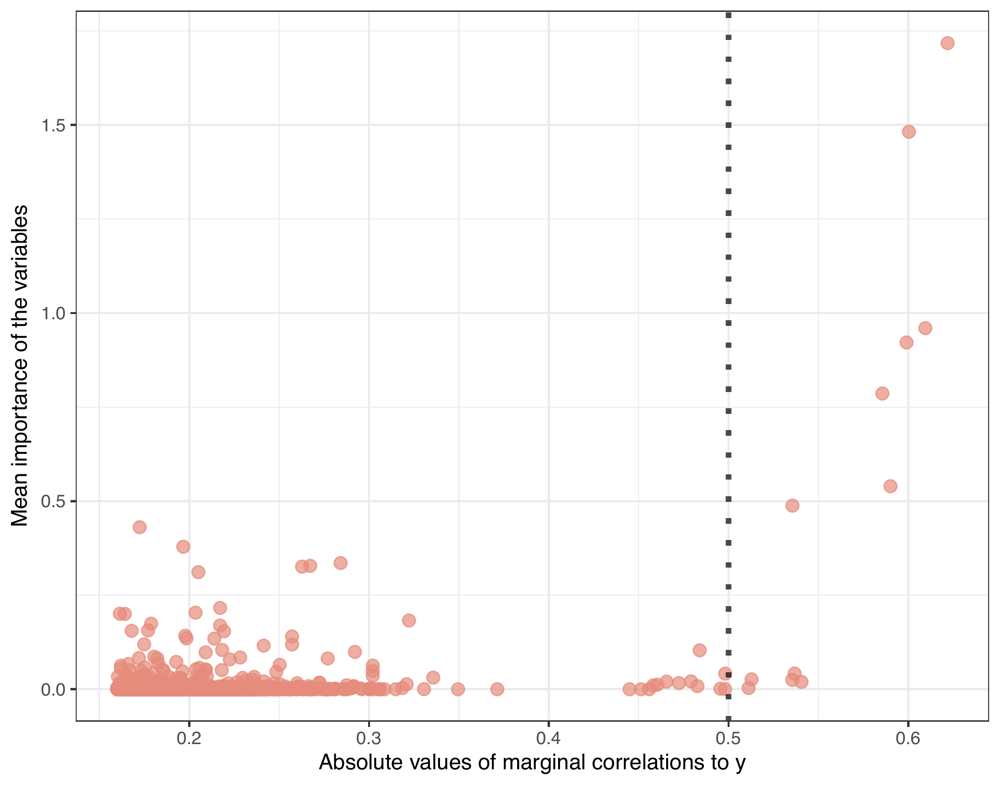
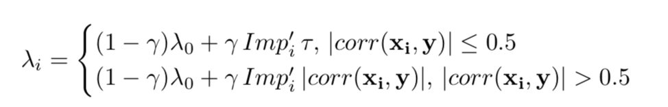
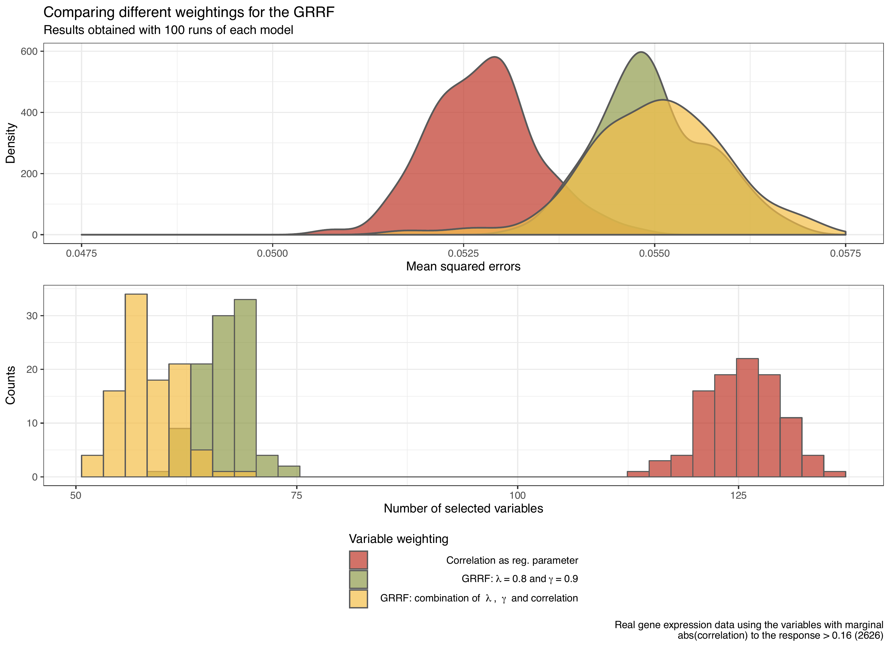

```{r setup, include=FALSE}
options(htmltools.dir.version = FALSE)
knitr::opts_chunk$set(message = FALSE, 
                      warning = FALSE, 
                      echo = FALSE, 
                      fig.align = 'center')
library(RefManageR)
library(tidyverse)

bibs <- ReadBib("bibliography.bib", check = FALSE)
```


# Outline

  1. Introduction
  2. Tree-based models
    - Trees
    - Random Forests
  3. Regularization
    - Regularization in Random Forests (RRF)
    - Guided Regularization in Random Forests (GRRF)
  4. Exploring the GRRF model
    - Evaluating the GRRF
    - Extending the GRRF
  5. Conclusions and Final Remarks


---
class: inverse, middle, center


# 1.  Introduction

---
# 1.  Introduction

- In real life regression problems, predictors can be hard or 
even economically expensive to obtain. 
- A common issue when dealing with any kind of regression modeling is the
subset selection. 

-   Subset selection $\neq$ Shrinkage/regularization 

```{r, out.height="8%", out.width="8%", fig.height=2}

```

<p style="text-align: center;"><b>
In shrinkage, the idea is to 'shrink' the regression coefficients towards zero. </b></p>


- Shrinkage *can*  lead to variable selection.
- In the common usage of regularization, the model is parametric and
there are regression coefficients to be 'shrunken'. 

---

# 1.  Introduction


- For tree-based methods, there is not yet a standard 
regularization procedure well stablished in the literature.

- Options exist, but  they still need to be evaluated and popularized. 

- The main goals of this presentation are to understand and 
explore regularization approaches for trees and random forests, focusing
in the one proposed in `r Cite(bibs[key = "guided"])`. 


---
class: inverse, middle, center


# 2. Tree-based models

---
# 2. Tree-based models
## Trees

Consider a variable of interest $Y_i \in \mathbb{R}$ 
and $\mathbf{x} = (x_{i1},\dots, x_{ip})'$ the set 
of predictor features, $1 \leq i \leq p$. A statistical
framework for non-parametric regression characterizes
their relationship as 

\begin{equation}
y_i = f_0(\mathbf{x_i}) + \epsilon_i, \thinspace
\epsilon_i \stackrel{iid}\sim N(0, \sigma^2), 
\end{equation}

where $f_0$ is an unknown regression function.


> A regression tree is a flexible non-parametric method that be can
applied to both regression and classification problems, 
based on the estimation of a series of binary conditional 
splitting statements (`if-else`) on the predictors space in order
to create prediction rules. 


---
## Trees

Each rule has the form: $x_j > x_{j,th}$, where  $x_j$ describes the value
of the feature at $j$ and $x_{j,th}$ is the decision cut point. The 
corresponding regression model predicts $Y$ with a constant $c_m$ in 
each splitted region $R_m$, or 

\begin{equation}
\hat f(\mathbf{x_i}) =  \sum_{m = 1}^{M} c_m I\{\mathbf{x_i} \in R_m  \},
\end{equation}

where $\mathbf{x}$ represents the set of predictor variables. In a 
regression scenario, the prediction is a constant value, usually the
mean of $y$ in each region and the minimized measure is the residual 
sum of squares, given by

\begin{equation}
RSS_{tree} =  \sum_{j = 1}^{J} \sum_{i \in R_j} (y_i - \hat y_{R_j})^2
\end{equation}

where $\hat y_{R_j}$ is the mean response for the observations in the 
*j*th region of the predictors space. 


---
# 2. Tree-based models
## Random Forests

A simple way to reduce variance in tree models is to take many training 
sets from the population, build a separate prediction for each tree and 
average the their final predictions, resulting a equation of the form

\begin{equation}
\hat f_{avg}(\mathbf{x}) = \frac{1}{B} \sum_{b=1}^{B} \hat 
f^{(b)}(\mathbf{x}),
\end{equation}


where B is the number of training sets and $\hat f^b(x)$ are the
estimated functions. To produce many training sets for trees, 
bootstrap resampling is a very popular choice 
`r Cite(bibs[key = "Hesterberg2011"])`. The method that consists in 
growing B regression trees using B sampled sets 
and averaging the predictions is called bagging ensemble 
`r Cite(bibs[key = "HastieTrevor"])`


---
## Random Forests

Random forests `r Cite(bibs[key = "Breiman2001"])` 
are a combination of trees that improves the bagging method by decorrelating
the trees, by considering only a sample $m$ of the predictors as splitting 
the candidate for each tree.  
  - The variables are selected randomly and $m$ is chosen 
  as approximately $\sqrt p$, with $p$ being the total of available features.

This slight change prevents the strong predictors to always appear on the 
top of the trees. Thereby, the average of the trees using the random forest
algorithm will be less variable and, hence, more reliable 
`r Cite(bibs[key = "HastieTrevor"])`. 

---
## Random Forests

- One characteristic of the random forest model
is that feature importance metrics can be obtained in a very easy way:
  - At each split in a tree, the improvement in the splitting criterion
  is the importance measure attributed to the respective variable. 
  - Those values are accumulated over all of the trees in the forest, 
resulting in the final measure of importance for the random forest model.

- Variable importance measures facilitate feature selection in 
random forests, but it does not work like an regularization.  

- Tree-based methods have an unwanted behaviour when in 
the presence of highly correlated variables: the importance values
are split between the correlated features. 


---
class: inverse, middle, center
#  3. Regularization

---
#  3. Regularization

In general, regularized regression consists 
in estimating a penalized function of the form

\begin{equation}
\underset{f \in H}{min} \Big[ \sum_{i = 1}^{N}
L(y_i, f(x_i)) + \lambda J(f) \Big ], 
\end{equation}


where $L(y, f(x))$ is the chosen loss function, $J(f)$ is a penalty
functional, and $H$ is a space of functions on which $J(f)$ is defined
`r Cite(bibs[key = "HastieTrevor"])`.

Regularization techniques produce models that are
more interpretable and can have the same or very similar prediction 
error as the full model. Also, regularization comes in hand when we need
to deal with many correlated features, because it is robust enough to not be 
influenced by them. 

---
#  3. Regularization
## Regularization in random forests

The usual regularization methods are mainly dedicated to parametric models. 
For the tree-based models, an  option is the one presented 
in `r Cite(bibs[key = "guided"])`, where the authors **penalize the variable importance values** of each variable for each
tree when building a random forest.

The simple version of method consists in applying a penalization parameter
for each spliting. The regularized information gain $Gain_{R}(X_i, v)$  
is written as

```{r, out.height="58%", out.width="58%", fig.height=1.3}

```


where $F$ represents the set of indices used in the previous nodes and 
$\lambda \in (0, 1]$ is the penalization applied to the splitting. When
$i \notin F$ (the variable is new to the tree), the $i_{th}$ feature
is penalized by splitting at the node $v$. 

---
## Guided regularization in random forests

In `r Cite(bibs[key = "guided"])`
the authors also introduce the Guided Regularized Random 
Forests (GRRF), that leverages the importance scores calculated from an
standard random forest model based on all the training data. The 
scores are used **to guide the next steps** of the regularized forest
trough the use a new parameter $\gamma$. 

First, a normalized importance measure is obtained with 

\begin{equation}
Imp_{i}^{'}  = \frac{Imp_i}{max_{j=1}^{P} Imp_j},
\end{equation}

where $Imp_i$ is the importance from an standard random forest model and 
$0 \leq Imp_{i}^{'} \leq 1$ and $P$ is the number of columns of the
features matrix. 

---
## Guided regularization in random forests

Now, instead of using the same penalization
coefficient to each variable, the penalization now depend on the  
importance measures obtained previously, that is

```{r, out.height="58%", out.width="58%", fig.height=1.3}

```


where $\lambda_i \in (0, 1]$  is the coefficient 
for $X_i (i \in \{1,...P\})$, that depends on the results of 
a standard random forest. We have that

\begin{equation}
\lambda_i = (1 - \gamma)\lambda_0 + \gamma Imp'_{i},  
\end{equation}

being that $\lambda_0$ represents the baseline regularization parameter 
and $\gamma \in [0, 1]$. In this fashion, a larger $\gamma$ leads to a 
smaller $\lambda_i$ and, thus, a larger penalty on $Gain(X_i, v)$ 
when $X_i$ has not been used in the nodes prior to node v.


---
class: inverse, middle, center


#  4. Exploring the GRRF model

---
#  4. Exploring the GRRF model
## Evaluating the GRRF

We tested both methods in simulated data. Using
the model equation proposed in 
`r Cite(bibs[key = "Friedman1991"])` , first we simulated a 
response variable $Y$ and its relationship to
a matrix of predictors $\mathbf{X}$ as

\begin{equation}
y_i = 10 sin(\pi x_{i1} x_{i2}) + 20 (x_{i3} -
0.5)^{2} + 10 x_{i4} + 5 x_{i5} +
 \epsilon_i, \thinspace
\epsilon_i \stackrel{iid}\sim N(0, \sigma^2),
\end{equation}

where $\mathbf{X} \in [0, 1]$, meaning that the predictors
were randomly drawn from a standard Uniform distribution. So, 
$y$ is related to each covariable as:

---

```{r fried, fig.cap="Relationship between y and each simulated covariable", out.width="70%"}

```

To this group of 5 variables, we also introduced a set of 30 noisy 
features, with many different levels of correlation, presented in the
next slide. 

---


```{r corr, fig.cap="Correlations between the noisy covariables."}

```

The simulated data was split into train (75%) and test (25%), so we
can assess the accuracy of the model in data not seen in the training phase.

---
## Evaluating the GRRF

A package for the statistical software `R` called `RRF` 
was created by the authors of the RRF and GRRF methodologies. We 
used this package in combination with the `randomForest` and 
the `rBayesianOptimization` packages to test four model in this data: 

  - a standard random forest model; 
  - a regularized random forest, with the $\lambda$ parameter set to 
  0.8;
  - a guided regularized random forest, with $\lambda$ set to 1 and
  $\gamma$ set to 0.9;
  - a version of the GRRF with the parameters set to the result of 
  a Bayesian optimisation in both of the parameters; the optimisation
  was conducted in the combination of the MSR calculated in 
  the test set and the final number of features in the model as
  we were hoping to find 
  
\begin{equation}
\min\limits_{\gamma, \lambda \rightarrow (0, 1]^{2}}\{ MSR_{\gamma, \lambda} + 0.8 \times (\text{# of variables})_{\gamma, \lambda} \}.
\end{equation}


*Bayesian optimisation: uses Bayesian models based on Gaussian 
processes to predict good tuning parameters, by creating a 
a relationship between the minimized measure and the parameters.*

---

```{r tabres, results='asis'}
library(formattable)
library(kableExtra)

res_fried <- readRDS("res_fried.rds") %>%  setNames(c(
  "Number of Variables", "MSR", "MSR + 0.8 # of Variables"
)) %>% 
  mutate_if(is.numeric, funs(round(., 2)))

data.frame(Model = c(
  "Random Forest",
  "Regularized Random Forest",
  "Guided Regularized Random Forest",
  "GRRF with Bayesian Optimization"
)) %>% bind_cols(res_fried) %>% 
  mutate(
       `MSR + 0.8 # of Variables` = 
         ifelse(`MSR + 0.8 # of Variables` < 31,
                   color_bar("lightgreen")(`MSR + 0.8 # of Variables` ),
                  color_bar("lightyellow")(`MSR + 0.8 # of Variables` ))
  ) %>% 
  knitr::kable(escape = FALSE, format = 'html',
               caption="Results of the four models fit to the Friedman simulated data added with noisy variables dataset.") %>%
  kable_styling(bootstrap_options = c("condensed", "hover"), 
                full_width = FALSE) %>% 
  column_spec(4, width = "4cm")  
```

The regularization parameters are not the performing the way we 
expect since:
  - the RRF model does not even get any regularization,
  - the GRRF still uses 17 variables,
  - the Bayesian optimised model is not doing well either. 
  
In terms of mean squared residuals, the models are very similar, but 
the GRRF stands out. Overall,  we recognize this model as being the 
best one, since it produced an MSR of 17.01 with the smallest set of 
features.


---
#  4. Exploring the GRRF model
## Evaluating the GRRF 

Consider now a real gene expression dataset, for which the purpose is to 
predict a continuous variable about race horses based on their gene 
expression. This case is particular interesting for a  breeding laboratory, 
since it's very expensive to obtain all of the gene variables.

As the dataset is highly-dimensional, with more than 48000 available
predictors and 835 observations, we choose to evaluate the behaviour
of the regularization parameters only in the first 1000 variables. 

We compared different configuration of the RRF and GRRF models by
varying the $\gamma$ and $\lambda$ parameters from 0.01 to 0.99:  
  - For each model, we calculated the mean squared residuals and the  
number of selected variables in the test set (25%),
  - The number of selected variables was determined by the ones with final
importance value $>$ 0. 

---


```{r comp_fried, fig.cap="Comparison of the number of selected variables and mean squared errors in the GRRF and RRF when varying their regularization parameters", out.width="80%", out.height="90%"}

```

  
---
## Evaluating the GRRF - Results

- When $\gamma$ increases in the GRRF, the model gets more regularized, but
the MSR does not change much:
  - A model with less variables is capable of keeping the same quality
of bigger models. 

- The RRF model selects less variables when the value of $\lambda$ is smaller
but its MSR behaves almost inversely, decreasing when more variables are 
used in the model.
- The MSR stabilizes after a certain value of $\lambda$.
  
In general, we observe that the regularization parameters are not
working as well as they should. 
  
---
#  4. Exploring the GRRF model
## Extending the GRRF

We propose and evaluate an extension of the method GRRF:
  - the extension is given by the change in the regularization criteria.  
  
First, we used the real gene expression data calculate the marginal 
correlations of all of the predictors and the response. Out of the whole 
original set of variables, we selected the ones with at least some correlation 
to the response in the train set, for which the cut point was determined as, for 
$\mathbf{x} = (x_{i1},\dots, x_{i48910})'$, 

\begin{equation}
|corr(\mathbf{x_j}, \mathbf{y})| > 0.16, \thinspace
\text{for} \thinspace j = 1,\dots,48910.
\end{equation}

This produced a subset of 2626, reducing significantly the dimension of 
the data. With this new smaller dataset, we run the GRRF model 100 times, 
using $\lambda = 0.8$ and $\gamma = 0.9$. The models allowed us to obtain 
a mean  importance measure for each variable, used to create a 
plot of the importance against their marginal correlations to $y$.  

---

```{r imp_corr, fig.cap="Marginal correlations of each predictor and $y$ versus the mean importance calculated in 100 re-runs of the standard GRRF model.", out.width="75%", out.height="75%"}

```

The line at 0.5 in the $x$ axis highlights the intense 
increase in the importance behaviour after this point. 

---
## Extending the GRRF

With that noted, we propose a new weighting formula for the predictors as 

```{r, out.height="65%", out.width="66%", fig.height=1.3}

```


where  $|corr(\mathbf{x_i}, \mathbf{y})| \in [0,1]$ and the new
parameter $\tau \in [0,1]$, but $\tau$ it's not expected to be bigger than 
0.5 for an actual regularization. **The idea is to give way less weight to variables that are just slightly correlated to the response, which is done by setting $\tau$ to a small value.** 

We fitted two more models 100 times: 
  - a second model using as the variable weighting the absolute values of
  the marginal correlations of $\mathbf{X}$ to $y$, 
  - a third model considering the extension proposed, 
using $\lambda = 0.8$, $\gamma = 0.9$ and $\tau = 0.2$.

---

```{r weights, fig.cap="Comparison of the MSR (evaluated in the test set) densities and histograms of the number of selected variables for 100 re-runs of the three models: (i) in green, the standard GRRF; (ii) in red, using simply the correlation as the variable weighting; (iii) using the methodology proposed.", out.width="105%", out.height="105%"}

```

---
## Extending the GRRF - Results

- The model that used only the correlation has the smallest  
 MSRs calculated in the test, but also a lot of selected variables.  
 
- The standard GRRF model  has bigger values for 
the MSRs, as well as it is using less variables, but is still not so 
regularized as it could be. 


- The third model resulted in almost the same density of MSRs as the 
standard. GRRF but the number of selected variables is 
way below the GRRF in most of the cases.

<p style="text-align: center;"><b>
This model can keep the MSR perfomance of an GRRF with 
parameters set to $\lambda = 0.8$ and $\gamma = 0.9$ and retain
less variables, improving the regularization of the model without 
having poor predictions. 
</b>

---
class: inverse, middle, center


#  5. Conclusions and Final Remarks

---
#  5. Conclusions and Final Remarks

- **The two regularization methods proposed in `r Cite(bibs[key = "guided"])` do not perform a very strict regularization as it might be desired.**
- Both techniques achieved a 'limit' of the least number of variables 
they can select on the simulated and real datasets used. 

- These regularization methods would not suffise in situations where
variable selection is the key point of the analysis. 

- An extension of the variable weighting in the GRRF was suggested: 
  > The extension consists in giving priority to variables highly 
  correlated to the response, having a baseline threshold to decide 
  which are those variables.

---
#  5. Conclusions and Final Remarks

- We need to  notice that categorical predictor variables were not
addressed here, demonstrating that such details still need to be determined. 

- Next steps include compare the method with variable selection, 
increase the size of model reruns and using cross-validation. 

Code at: `https://github.com/brunaw/regularization-rf` 


---
class: center, middle

## Acknowledgments

This work was supported by a Science Foundation Ireland Career Development Award grant number: 17/CDA/4695

```{r, echo=FALSE, fig.align='center', out.height="40%", out.width="50%", fig.height=2}

```


---
# Bibliography


```{r, results='asis'}
print(bibs[key = c("guided", "Hesterberg2011", "HastieTrevor",
                  "Breiman2001", "Friedman1991")], 
      .opts = list(check.entries = FALSE, 
                   style = "html", 
                   bib.style = "authoryear"))
```


---
class: center, middle, inverse

# Thanks!


 

<b>

[@brunaw](https://github.com/brunaw)
